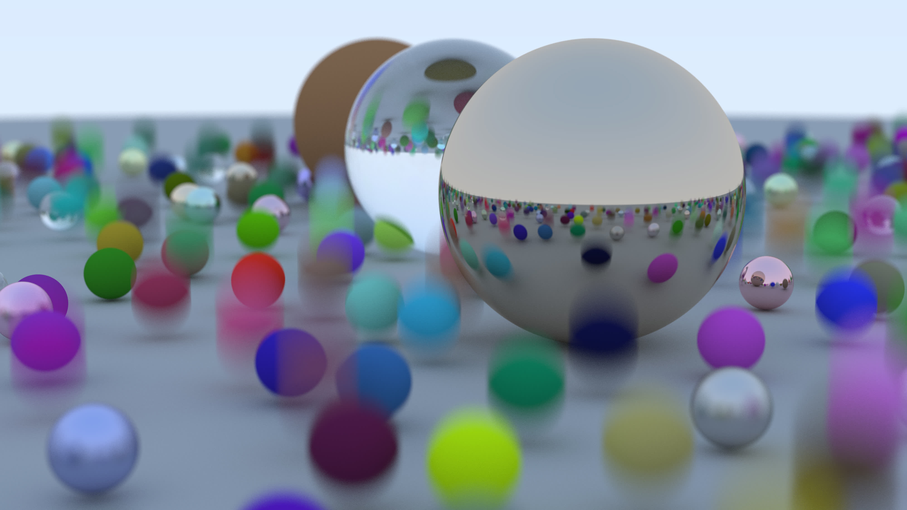

# Small Ray Tracer in Odin

Wanted to mess around with [Odin](https://odin-lang.org/) and learn some graphics.
Following the [this book series](https://raytracing.github.io/).

Definitely not the prettiest code as I was/am learning some Odin along the way.
I've only done the first book and a little bit of the second one =)

Here's a screenshot:

